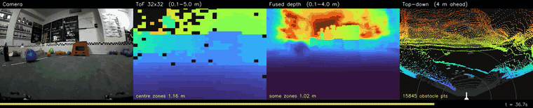

# RingFusion

Real-time metric depth + point clouds from **one wide-angle camera and a sparse
multizone ToF sensor**, on an NVIDIA Jetson AGX Orin. A monocular depth network
supplies dense *structure*; the ToF supplies absolute *scale*; a closed-form
least-squares fit joins them with **no learned parameters**. Design notes and the full task
tracker live in [`ros2_ws/README.md`](ros2_ws/README.md).


*Live on the Orin at 13.7 Hz end-to-end (blend + ROI off; the default configuration measures
10.4 Hz — see Status below). Left to right: rectified camera · 32×32 ToF (the only real
distance measurement) · fused metric depth · top-down obstacle map. Full 34 s clip and an
**interactive 3D flythrough** of the same drive:
[`docs/demo/network_b_v1_vs_v2.html`](docs/demo/network_b_v1_vs_v2.html) — open it in a browser,
it is fully self-contained.*

<table>
<tr>
<td width="50%"><br>
<sub><b>What the ToF actually sees</b> — 1024 zones, black where no return. This sparse grid
is the entire source of metric scale.</sub></td>
<td width="50%"><br>
<sub><b>Bird's-eye map</b> derived from the fused cloud — robot at bottom-centre, rings at
1/2/3 m, ground faint, obstacles coloured by distance.</sub></td>
</tr>
</table>

## Repository layout

| Path | What |
|---|---|
| [`ros2_ws/`](ros2_ws/README.md) | ROS 2 Humble workspace — sensor drivers, perception pipeline, bringup. **Main README + full task tracker live here.** |
| [`training/`](training/README.md) | Off-robot training + export (distill backbone, train residual, ONNX → TensorRT). |
| `firmware-esp/` | ESP32-C6 firmware streaming TMF8829 ToF frames. |
| `tools/` | `calibrate_camera.py` (fisheye calibration) + ONNX/engine build scripts. |
| `CAD-files/` | Mechanical (Fusion/SLDASM). |
| `checkerboard_9x6_25mm.pdf` | Print-ready calibration target (100% scale). |

## How it works

```
Arducam fisheye ──▶ rectify (fisheye → pinhole) ──▶ Network A  ──┐
                                                   (relative     │
                                                    disparity)   │
                                                                 ▼
ESP32-C6 ──▶ TMF8829 32×32 ToF ──▶ project zones to pixels ──▶ closed-form
             (binary, ~16 Hz)      (mirror + FOV corrected)    affine fit  ──▶ metric depth D₀
                                                                 │              (no learned
                                                                 │               parameters)
                                                                 ▼
                                            Network B (residual) ──▶ /depth  /depth_var  /cloud
```

**Network A** predicts *relative* disparity — good structure, no scale. **The ToF** supplies
scale but only 1024 sparse zones covering **12.4 % of the frame**. A robust 2-parameter fit
maps disparity → inverse depth using those zones as anchors; that step is pure geometry and
has no learned parameters, so the system produces valid metric depth even with Network B
switched off. **Network B** then applies a learned per-pixel correction plus a variance
estimate, supervised on held-out ToF zones.

## Status — 2026-08-04

**Running live end-to-end on the Orin with both real networks.** The rate depends on whether
the two optional stages (Stage 7c blend, Stage 4b/7d ROI) are on — both default to **on**:

| configuration | measured on the robot |
|---|---|
| blend + ROI **on**, **+ σ terms** (default, current) | **9.38 Hz** ✅ above the ToF's 8.3 Hz |
| blend + ROI **on**, before the σ terms | **10.29 Hz** |
| blend + ROI **off** | **13.3 Hz** ✅ |

*(9.38 Hz measured 2026-08-04 under lights, and 9.35 Hz in the dark — scene content does not
move it. The drop from 10.29 Hz is the Stage 7c σ terms, which cost a measured
**10.6 ms/frame**; see the correction below. Figures of **10.4 Hz** elsewhere in these docs are
the 2026-07-30 measurement, before both.)*

Measured 2026-07-30 with [`rate_live.py`](tools/diagnostics/rate_live.py); earlier figures of
13.7 Hz predate these stages and correspond to the second row; the default configuration was
7.2 Hz when first measured and reached 10.4 Hz after moving the blend expansion and the ROI
mask onto the GPU. Depth maps arrive a median **128 ms** old (was 426 ms — a queueing fix, not
a speed one). Perception, not the ToF, is the
constraint ([reconciled here](ros2_ws/README.md#throughput-reconciled)); the per-stage
breakdown and the reason the offline estimate was 38 ms optimistic are
[here](ros2_ws/README.md#the-deployed-rate-measured-2026-07-30).

| | value |
|---|---|
| `/depth`, `/depth_var`, `/cloud` | **9.38 Hz** default / **13.3 Hz** with blend+ROI off *(deployed node, incl. ROS + rectification)* |
| Depth error, extrapolating away from the ToF | **0.034 m** median (`center` protocol, 200 held-out frames). ✅ **Confirmed on the moving robot 2026-08-04** after the field-of-view fix — 600 frames, blend −6.3 % MAE, see below |
| Depth error, interpolating between ToF zones | **0.014 m** median (`random` protocol) |
| Uncertainty quality, `corr(σ, \|error\|)` | **0.943** *(at ToF anchor pixels — circular)*. Against **tape**: rank corr **+0.655**, coverage@1σ **0.818** vs a 0.683 target — see [LIVE-4](#is-the-uncertainty-trustworthy-live-4-2026-08-04) |
| Backbone agreement with truth, ρ | **0.917** *(deployed config; the projection sweep's best row was 0.914)* |
| CPU / GPU under full load | **32 % of 12 cores · 26 % GPU · 21.7 W** — neither is saturated |

*Configuration: `student_v4_heldout` + `residual_v7_fov73` + Stage 7c blend, at the corrected
`fov_h 73.5`. Scored on **200 frames Network A never trained on** — the first uncontaminated absolute numbers in the project.
Previously published 0.042 / 0.009 were inflated by train/test overlap; the correction is
**+5 %**, see [contamination](ros2_ws/README.md#traintest-contamination-quantified).*

> **Two corrections to the previous version of this table.** The `center` row was labelled
> "1,234 frames" while the caption said 200 held-out frames — they cannot both be true, and the
> 200-frame held-out figure is the honest one, so the label is now fixed. The `random` row read
> **0.010 m**, which does not match any current measurement (held-out gives 0.0143 m, all-frames
> 0.0148 m); it has been corrected to the measured value. The `center` figure improved
> **0.043 → 0.034 m** on the `residual_v7` retrain.

> The previously headlined **0.199 m** was measured **in-sample** — the on-robot harnesses
> fitted and scored on the same ToF zones. A nearest-neighbour lookup scores 0.000 m under
> that protocol. Corrected 2026-07-28; see
> [Benchmarks](ros2_ws/README.md#benchmarks-vs-trivial-baselines).

### Calibration bugs have dominated this project twice

**2026-07-28.** The ToF grid was **horizontally mirrored** relative to the camera *and*
`fov_h`/`fov_v` were **swapped**. Every anchor landed on the wrong pixel, corrupting the
affine fit and every metric downstream of it.

**2026-08-03.** `fov_h` was *still* wrong — set to 45° against a true ~73.5°, so the grid was
squeezed into the middle two-thirds of its real field. The July fix had chosen between two
candidates (61×45 and 45×61) rather than sweeping a continuum, so the less-bad of two poor
options won and was recorded as measured. **No ToF-scored benchmark could see this**, because
the anchors and the evaluation targets are the same points — it took a tape measure. See
[Measured against a tape measure](#measured-against-a-tape-measure-on-our-own-rig).

The pattern is the point: both were found by an *independent* measurement, and neither was
visible to any closed-loop metric.

<table>
<tr>
<td width="50%"><br>
<sub><b>Before</b> — ToF anchors coloured by measured distance, scrambled across the scene.
ρ 0.737.</sub></td>
<td width="50%"><br>
<sub><b>After</b> — far/red on the back wall, near/blue on the floor, clean gradient.
ρ 0.917, depth MAE −21 %.</sub></td>
</tr>
</table>

It also overturned an earlier conclusion: the Depth Anything V2 teacher had scored no better
than the distilled student (ρ 0.750 vs 0.737), which read as "monocular depth is intrinsically
hard here". Both were simply being scored against misprojected anchors. **The backbone was
never the bottleneck.**

### Benchmarked against trivial baselines

Every method below sees the same anchors and is scored at the same held-out ToF zones, over
all 1,234 logged pairs. Two protocols, because the choice changes the winner:

**MAE**, all 1,234 frames (the `v4` + blend figures in the status block above are **medAE** on
the 61-frame held-out split — different statistic, different sample, not comparable to this
table):

| MAE | `random` *(interpolate, anchors ~1.7 cm away)* | `center` *(extrapolate outward)* |
|---|---|---|
| nearest-zone lookup *(0 params, no camera)* | **0.073 m** | 0.232 m |
| bilinear ToF upsample *(0 params)* | 0.059 m | *cannot extrapolate* |
| closed-form + clamp *(2 params)* | 0.262 m | 0.314 m |
| **RingFusion** *(~0.46 M params)* | 0.190 m | **0.198 m** |
| **+ Stage 7c blend** | **0.060 m** | **0.188 m** |

**A zero-parameter lookup table beats the full pipeline when the ToF is dense nearby** — and
that is the honest reading of the protocol every earlier number used. The architecture earns
its keep somewhere else entirely: median error vs. distance from the nearest real
measurement,

| medAE | 0–3° | 3–6° | 6–10° | 10–15° | 15–30° |
|---|---|---|---|---|---|
| nearest-zone lookup | **0.027** | 0.072 | 0.122 | 0.180 | 0.239 |
| RingFusion v3 | 0.064 | 0.073 | 0.078 | **0.062** | **0.047** |

Nearest-neighbour degrades **9×** as it leaves the measurements; the camera path stays flat
and wins 3–5× past 10°. Since the ToF covers 12.4 % of the frame, that is the regime the
robot actually runs in.

### Two fixes this produced

**Network B was being quizzed wrong.** Hiding 25 % of ToF zones at random leaves a real
measurement ~1.7 cm from almost every supervision target, so the network only ever learned
interpolation — and scored *tied with having no network at all* on extrapolation (0.066 vs
0.064 m). Supervising on a held-out outer region instead (`--holdout island`, one changed
argument, same architecture and data) took it to **0.045 m, a 30 % win over the closed-form**.

**Neither source wins everywhere.** Raw ToF is still the best thing available within 3° of an
anchor; the network is **5.7× better** past 15°. Stage 7c blends them by angular distance and
**beats both**:

| medAE | 0–3° | 3–6° | 6–10° | 10–15° | 15–30° |
|---|---|---|---|---|---|
| nearest-zone ToF | **0.027** | 0.063 | 0.104 | 0.163 | 0.204 |
| Network B (v7) | 0.033 | 0.028 | **0.031** | **0.032** | **0.036** |
| **blend** | **0.026** | **0.027** | **0.031** | **0.032** | **0.036** |

*(1,234 frames, `center` protocol, current build — `fov_h 73.5` + `residual_v7_fov73`.)*

The `residual_v7` retrain moved every bin. Under v6 the network only overtook the ToF past 6°;
it now overtakes it at **3°**, and the ToF's remaining advantage in the innermost bin has
narrowed from 1.7× to 1.2×. The blend still wins the 0–3° bin outright (0.026 vs the ToF's
0.027), which is the point of blending rather than switching: averaging two partly-independent
estimates near the crossover cancels noise that neither cancels alone.

<details><summary>v6 → v7, same 1,234 frames</summary>

| medAE, `center` | v6 | **v7** | |
|---|---|---|---|
| B5 ringfusion | 0.0445 | **0.0326** | −27 % |
| B6 blend | 0.0425 | **0.0319** | −25 % |
| B5 RMSE | 0.4514 | **0.3960** | −12 % |
| B6 RMSE | 0.4394 | **0.3890** | −11 % |

`random` protocol barely moves (B6 0.0148 → 0.0144) — the interpolation regime was already at
the ToF's own noise floor. `B1_nearest` is bit-identical across the two runs, which confirms
only the residual changed.
</details>

Also fixed: the closed-form path was **missing the 20 m clamp** the residual path applies,
so the Network-B-off fallback could publish 10,000 m into `/cloud` — worth 18.092 m →
0.359 m. Full detail: [Benchmarks](ros2_ws/README.md#benchmarks-vs-trivial-baselines).

### Measured against a tape measure, on our own rig

Every table above is scored against the ToF the pipeline anchors to — a closed loop. The first
time we broke it, with markers on the field and a tape measure, **it immediately found a
calibration error nothing else could see: the ToF's horizontal field of view was set to 45°
and the true value is ~73.5°.** Readings were correct but attributed to the wrong pixels.

Seven markers, −43° to +48° off axis, hand-measured. Same scene before and after:

| # | marker | **tape** | before | err | **after** | **err** |
|---|---|---|---|---|---|---|
| 1 | leftmost wall, −43° | 1.80 m | 1.37 m | −0.43 | 1.60 m | −0.20 |
| 2 | yellow discs, −33° | 0.76 m | 1.51 m | +0.75 | **0.75 m** | **−0.01** |
| 3 | white barrier, −0.5° | 1.66 m | 1.65 m | −0.01 | 1.64 m | −0.02 |
| 4 | red pole, +8° | 2.03 m | 2.78 m | +0.75 | 2.80 m | +0.77 |
| 5 | water bottle, +12° | 0.63 m | 1.42 m | +0.79 | **0.61 m** | **−0.02** |
| 6 | blue block, +36° | 0.72 m | 0.82 m | +0.10 | **0.68 m** | **−0.04** |
| 7 | red stool, +48° | 0.89 m | 0.73 m | −0.16 | 1.17 m | +0.28 |

| | before | after | |
|---|---|---|---|
| **MAE** | 0.427 m | **0.192 m** | −2.2× |
| **median \|err\|** | 0.431 m | **0.044 m** | **−9.8×** |
| **RMSE** | 0.530 m | **0.321 m** | −1.7× |

Four of seven markers went from 0.10–0.79 m of error to **within 4 cm**. Two did not: **#4**
is a thin pole whose ToF zone reads 2.03 m correctly while its neighbours see the wall 2.78 m
behind — partial fill, not calibration; **#7** sits outside the ToF cone entirely and is
unsupported extrapolation.

**The honest split:** the calibration fix delivered 0.427 → 0.193 m. Retraining Network B on
the re-projected supervision then delivered 0.193 → **0.192 m** — nothing — while *halving*
its score on the ToF-scored benchmarks. That gap between a closed-loop metric and a tape
measure is the entire reason this workstream exists.

Full detail, per-marker data and the field-of-view derivation:
[ToF field of view, measured against tape](ros2_ws/README.md#tof-field-of-view-measured-against-tape).
Pilot scale — 14 tape points, 0.39–2.03 m, no far field. Directional, not a certified number.

> **This table is a `residual_v6` measurement and has not been redone on `residual_v7`.** The
> markers have not moved, but re-measuring needs the lights on. v7's offline gain is
> concentrated in extrapolation — exactly where markers #4 and #7 fail — so this is the table
> most likely to move. Until it is redone, **v7 is confirmed better at agreeing with the ToF
> and unconfirmed against ground truth.** Given that v6 halved its ToF-scored error and moved
> this tape MAE by 1 mm, expect the tape gain to be well under v7's 25 % offline figure.
>
### `fov_v` verified — 2026-08-04

The vertical field of view was the last unmeasured number in the geometry, and after `fov_h`
turned out to be 1.6× wrong we expected the same again. **It is correct**, confirmed three
independent ways with eight markers spanning UP 35° to DOWN 9°, plus the floor:

| evidence | result |
|---|---|
| 5 markers, 0.33 – 3.03 m | within 1–10 cm of tape, **MAE 0.043 m** |
| floor vs a 16.2 cm lens-height tape | implies **15.97 cm** — 2.3 mm |
| cone edge, bracketed | inside at UP 30.1°, outside at UP 35.3°; config says 30.25° |

That third row is the cleanest: a marker just inside the edge finds a ToF ray 0.24° away, one
just outside finds nothing nearer than 5.0°. **The calibration's field-of-view numbers are now
both measured rather than assumed.**

> **One claim retracted.** Mid-session a plane fit to the floor reported a 4.46° tilt, written
> up at the time as a probable ToF-vs-camera pitch error. It was a fitting artifact. The direct
> test bounds any pitch **under ~2°** and cannot resolve it; `rotation_rpy_deg` stays `[0,0,0]`.
>
> **Where the extrinsics stand.** *Pitch* is bounded under ~2° (above). *Yaw* is bounded to
> about **±1°** by the `fov_h` session, which is indirect but real: seven markers from −43° to
> +48°, at depths from 0.63 to 2.03 m, all resolved to the correct zone — a yaw error beyond
> half a zone pitch (~1.15°) would have picked the wrong column and returned a visibly wrong
> distance. *Roll* has no direct evidence; it is assumed zero on the grounds that both sensors
> share one mount and roll's effect vanishes near the optical centre. The *translation* is a
> caliper measurement the data cannot see — an 80 mm `ty` sweep changes nothing measurable.

Full detail: [`fov_v` verified against tape](ros2_ws/README.md#fov_v-verified-against-tape--2026-08-04).

### Is the uncertainty trustworthy? LIVE-4, 2026-08-04

Every depth pixel ships with **σ** — the system's own estimate of how wrong it might be, in
metres. **σ is not a score; lower is not better.** Too small and the robot trusts a bad reading;
too large and nothing is usable. It should simply *match* the error actually made: about 68 % of
readings inside 1σ, and the large-σ pixels should be the wrong ones.

Measured stationary against **11 tape points from 0.33 m to 3.36 m**, 15 frames averaged:

| | result | target | |
|---|---|---|---|
| rank corr(σ, \|err\|) | **+0.655** | → +1 | usable |
| coverage @1σ | **0.818** | 0.683 | too wide |
| coverage @2σ | **0.818** | 0.954 | too narrow |
| median \|err\| | **0.081 m** | — | |

**σ works where it matters most and fails where it matters more.** Outside the ToF cone the
pipeline is wrong by 1.07 m and 1.52 m — and reports σ of 2.10 and 1.84, correctly saying *"I am
guessing."* But coverage is **0.818 at both 1σ and 2σ**: identical, meaning every point that
escapes 1σ also escapes 2σ. The distribution has the wrong *shape*, so no rescaling fixes it.

The blind spot is **mixed returns**. One marker sits on a banner 2.89 m back while its ToF zone
clips a bottle 0.33 m away — the pipeline reports **0.34 m, off by 2.55 m, with σ of just 0.66**
(3.9σ). *"Far surface with a near object in front"* is what an obstacle **is**, so this is the
one case a ground robot cannot afford confidence in.

Also found: at a marker 47.8° off-axis the **ToF zone reads 0.72 m against a 0.736 m tape —
essentially exact — while the fused output says 1.20 m.** Fusion degrades a correct sensor
reading outside the cone; the third independent sighting of that effect.

**Then fixed, the same day.** All three failures were visible inside the blend stage and were
being discarded. Three variance terms now feed on them — how far the blend moves the depth,
how far away the nearest anchor is, and whether a zone disagrees with its neighbours:

| | before | after |
|---|---|---|
| rank corr(σ, \|err\|) | +0.655 | **+0.745** |
| points failing 1σ | 2 | **1** |
| worst failure | 3.86σ | **2.30σ** |
| out-of-cone marker | 2.04σ ❌ | **0.38σ** ✅ |

**Cost 10.6 ms/frame** — measured 2026-08-04 by bypassing the block, 40 real frames: blend only
15.90 ms, blend + σ terms 26.54 ms. Deployed rate **10.29 → 9.38 Hz**, still above the ToF's
8.3 Hz floor.

> **This corrects an earlier claim of 0.80 ms in this file.** That A/B turned the terms off by
> zeroing their constants, which leaves every allocation, both `cv2.blur` calls, the GPU
> upsample and the full-frame add still running — it measured arithmetic *values*, not
> arithmetic. The deployed rate exposed it: a 9.4 ms drop that 0.80 ms could not explain. The
> corrected figure predicts 9.27 Hz against 9.38 Hz measured.

> **The one step that turned out to be impossible is the interesting one.** Re-fitting the σ
> *scale* cannot work here: shrinking σ to hit the 0.683 coverage target pushes the mixed-return
> case to **6.2σ**, while enlarging it covers everything at 1.000. The errors are heavy-tailed,
> so no single multiplier serves both ends — coverage got *worse* (0.818 → 0.909) precisely
> because the dangerous case is now covered. Proper calibration needs a heavier-tailed model,
> not a constant.

Full detail, including two wrong turns worth not repeating:
[σ fixed](ros2_ws/README.md#σ-fixed--three-terms-the-blend-already-knew-2026-08-04).
**n = 11, and three constants were tuned against those 11 points** — provisional until a larger
session.

### The blend, re-tested on the moving robot — 2026-08-04



*Camera · ToF 32×32 · fused depth · top-down, from the 45 s drive. Full clip:
[`drive_4panel_v7.mp4`](docs/demo/clips/drive_4panel_v7.mp4).*

The 2026-07-30 blend A/B predated the field-of-view fix, and the blend acts near anchors, so
moving the anchors invalidated it. Re-run on the same protocol — 600 frames driving, both arms
from **one** backbone+residual pass per frame, blend fed only the central island, 386 681
held-out zones scored outside it:

| `center`, held-out zones | MAE ↓ | medAE ↓ | p95 ↓ | δ<1.25 ↑ |
|---|---|---|---|---|
| network alone | 0.2640 m | 0.0726 m | 1.0228 m | 0.687 |
| **+ blend** | **0.2474 m** | **0.0648 m** | **0.9768 m** | **0.707** |
| | −6.3 % | −10.7 % | −4.5 % | +2.0 pp |

**The blend wins on every metric, by a wider margin than before** (−6.3 % MAE against −5.4 %),
and now improves temporal stability rather than merely not hurting it (0.0100 vs 0.0106 m
frame-to-frame).

**The result that matters is a sign reversal.** Split by angular distance from the ToF island,
the 10–15° bin — the one closest to the anchors, hence most exposed to anchors being in the
wrong place — read **0.0375 m blended against 0.0336 m unblended before the fix**. The blend was
making it *worse*, and the original write-up dismissed it as the medians barely moving. It was
not noise. After the fix the same bin reads **0.0075 m**, a 94 % improvement over its own
no-blend arm. At 30–90° both arms are identical, which is correct where no anchor is near.

> **The raw error levels are worse than the 2026-07-30 run and that is not a regression.**
> Different drive, different route, and this one ran ~4× faster in frame-to-frame motion. Error
> depends far more on the scene than on any setting — which is precisely why both arms come from
> one pass on one frame. **Only the within-run gap is controlled.**

Rate re-confirmed the same session with the lights on, since 9.35 Hz had been measured in the
dark: **9.38 Hz**. Scene content does not move it.

`blend_ab_live_v7_2026-08-04.json`, `rate_live_v7_lights_2026-08-04.json`.

### On a public benchmark, with independent ground truth

[ZJU-L5](ros2_ws/README.md#zju-l5--the-first-open-loop-evaluation-and-what-it-exposed) ships
dense RealSense ground truth, so it is the one evaluation here that is not scored against our
own ToF. **Unaffected by the calibration fix** — the dataset supplies its own per-zone pixel
rectangles, so `calibration.yaml` never enters. Against published results on it:

| method | params | δ₁ ↑ | Rel ↓ | RMSE ↓ |
|---|---|---|---|---|
| CFPNet | — | 0.883 | 0.103 | **0.431** |
| PENet | — | 0.889 | 0.093 | **0.447** |
| **ours — zero learned fusion** | 24.8 M backbone | **0.908** | **0.091** | 1.031 |
| **ours — zero learned fusion** | 335 M backbone | **0.913** | **0.083** | 0.953 |
| DEPTHOR-Small | 24.8 M + 6 M | 0.923 | 0.079 | 0.371 |
| *ours — as deployed on the Jetson* | *4.1 M* | *0.716* | *0.185* | *1.174* |

Run on **DEPTHOR's own ViT-S backbone**, so the only difference is 6 M of learned completion
versus none. **Competitive with learned depth-completion on typical-pixel accuracy, using no
learned fusion at all, on a benchmark neither network ever trained on** — and 2.2× worse on RMSE, which is an unresolved
far-field tail, not noise. The two rows are different configurations and the gap between them
is the cost of distilling the backbone down for real-time use; see Known limits.

### Known limits

- **ToF covers 12.4 % of the frame.** The other 87.6 % is monocular extrapolation carrying the
  affine fit. A geometry limit, not a bug, but it bounds what can be trusted.
- **Most numbers in the tables above are scored against the ToF we anchor to** — a closed
  loop. It cannot detect a ToF bias and says nothing about the 87.6 % of frame the ToF never
  sees. The two open-loop exceptions are
  [ZJU-L5](ros2_ws/README.md#zju-l5--the-first-open-loop-evaluation-and-what-it-exposed) and
  the tape session above — which found a 1.6× field-of-view error that every closed-loop
  metric had been blind to for weeks.
- **The tape session is a pilot, not a validation.** 14 points, 0.39–2.03 m, two poses, no
  far field. It is enough to have caught a gross calibration error and to show the direction
  of travel; it is not enough to certify a number. A full session is blocked on the printed
  markers, whose ink goes sub-pixel past ~0.5 m and is unreadable beyond ~2 m.
- **Network A does not transfer to another camera.** On ZJU-L5, `student_v3` scores
  ρ 0.417 against 0.917 on our own sensor, and the pipeline then loses to every trivial
  baseline. It was distilled on ~2,000 of our own fisheye frames, so it learned to be its
  teacher *on one lens*. The analytic fit transfers; the learned backbone does not. Scoped
  rather than fixed — the robot has one camera — but it bounds what can be claimed.
- **Network A trained on the entire benchmark set.** `training/data.py` globs recursively, so
  distillation swept up the 1,228 paired-log frames — byte-identical to every frame the
  benchmarks score on. Rankings are unaffected (all methods share the backbone) and the
  inflation is bounded (the student scores *below* its teacher on those very frames, so it has
  not memorised them), but absolute numbers are optimistic by an unquantified amount. Fix is a
  held-out re-distill.
- **A far-field ceiling, now diagnosed.** `D = 1/(a·disp + b)` asymptotes to `1/b`, so `b`
  caps the deepest expressible depth. On our sensor that ceiling is a median **1.43 m while
  the ToF reads to 4.16 m** — 14.4 % of anchors are not expressible, and anchors past 1.5 m
  are 16 % of data but **69 % of error**. A pooled MAE hid it because 51 % of anchors sit
  under 0.5 m. The **analytic** σ does not flag it either — 150× too small at range and *decreasing*, since
  `Var[D] ∝ D⁴` inherits the same cap. But the analytic term is only ~0.1 % of deployed
  `/depth_var` (the learned head is ~99.9 %), so **deployed far-field σ is still untested**.
  A clamp and a σ-filter were tested and **falsified**; removing the ceiling entirely
  (scale-only) **triples RMSE**, because `b` also regularises disparity noise at range. A
  small ridge on `b` buys ~8 % Rel at no near-field cost. σ now floors itself outside the ROI
  rather than claiming ±8 cm on pixels metres wrong. Full detail:
  [the ceiling section](ros2_ws/README.md#the-far-field-ceiling--mechanism-and-what-does-and-does-not-fix-it).
- **v3 under-corrects** — mean |B−A| is only 0.019 m. The benchmarks suggest why: it was
  supervised only on zones ~1.7 cm from an anchor, where the closed-form answer is already
  right, so near-identity is the correct thing to learn. That points at the *training
  protocol* rather than the structure-loss weight.
- **Network A is pilot-quality** — 2,000 images; a full ~15–20 k re-distill is pending.
- **Checkpoint selection is noisy** — the validation split is ~62 samples against a
  heavy-tailed NLL loss.

Full detail, per-run numbers and the task tracker:
[ros2_ws/README.md](ros2_ws/README.md). Capture and diagnostic tooling:
[tools/diagnostics/](tools/diagnostics/README.md). All captures:
[docs/demo/](docs/demo/README.md).

## ▶ Do next

1. **Live-test the new configuration** — v4 + blend are validated offline only; the deployed
   path has not run on the robot yet.
2. **Collect independent tape ground truth** (~20 marked points, half outside the ToF box)
   — the only item that breaks the closed loop, and the only way to check whether the blend
   smears object boundaries. See [the plan](docs/VALIDATION_PLAN.md).
3. **DEPTHOR-Small on the Orin**, then **ZJU-L5** — the two remaining external benchmarks.
4. **Widen the validation split** — 61 frames is too noisy for checkpoint selection, and
   `last` beat `best` on both v4 and v5 (validation NLL does not track medAE).
5. **Retrain Network B on ZJU-L5's train split** — would give a directly comparable *learned*
   row there instead of analytic-path-only. Not built.
6. **Re-distill Network A on the full ~15–20 k set** — now known not to have been the limiting
   factor, and `student_v4_heldout` shows the pipeline trains correctly again.

## Output: point cloud → LiDAR / SLAM layer (planned)

The pipeline publishes `/cloud` (`sensor_msgs/PointCloud2`) — per-frame **metric 3D points**
(back-projected from the depth via the camera intrinsics), the same data type a LiDAR or
depth camera emits. So it feeds RViz, PCL, Nav2, and SLAM nodes directly.

**Coverage — how it compares to LiDAR.** We are **forward-facing**, not 360°: the cloud
covers the **camera's FOV cone** (denser than LiDAR — ~125k pts/frame — but narrower). True
all-around coverage needs the multi-module **ring** (future) or driving/turning to sweep.

**Depth confirmation coverage.** The ToF is a **32×32 = 1024-zone grid** over its central
~73.5°×60.5° cone (≈830 valid zones/frame in practice), so it ground-truths **many objects at
once across the center**, not a single point. The wider camera **periphery** is dense but
**mono-estimated** (scaled by the global fit, not ToF-confirmed) — which is exactly what
**Network B** refines and assigns calibrated uncertainty. Held-out ToF anchors are how we
*measure* depth accuracy at many non-center points (see training/README §2a). Over motion the
narrow ToF cone **sweeps** the scene, so an accumulated map ends up ToF-confirmed far beyond
any single frame's center.

**SLAM without wheel odometry — yes.** Like LiDAR SLAM (which also has no wheels), motion is
recovered **from the sensor data itself**: register consecutive frames — geometrically (ICP
on the clouds) and/or visually (RGB feature tracking + our metric depth = RGB-D odometry) —
then accumulate. Two advantages over the alternatives: the ToF gives **absolute scale every
frame** (no monocular-SLAM scale drift), and the RGB enables **visual loop closure** (harder
for bare LiDAR). The cost is our **narrow FOV** (less frame-to-frame overlap → more drift on
fast turns / blank walls / long corridors), where an optional **IMU or wheel-odom prior** adds
robustness but is **not required**. Fastest path to a working no-wheels map: `/depth` + RGB
into **RTAB-Map** (RGB-D SLAM). This is the last roadmap stage (post-Network B).

## Quick start (view the live sensors)

```bash
cd ros2_ws && colcon build --symlink-install && source install/setup.bash
ros2 launch ringfusion_bringup feeds.launch.py   # camera + ToF heatmap; see ros2_ws/README.md
```
