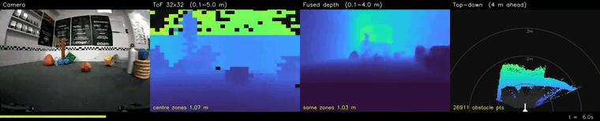
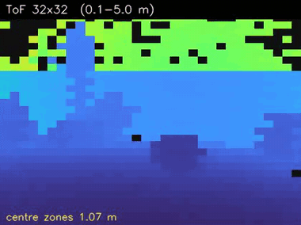
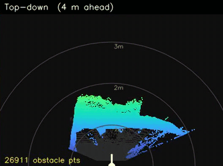
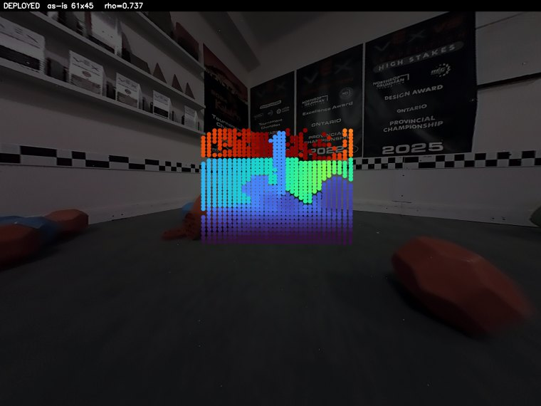
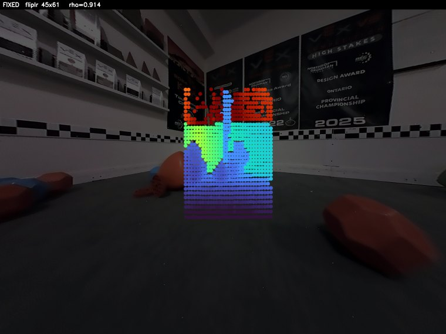

# RingFusion

Real-time metric depth + point clouds from **one wide-angle camera and a sparse
multizone ToF sensor**, on an NVIDIA Jetson AGX Orin. A monocular depth network
supplies dense *structure*; the ToF supplies absolute *scale*; a closed-form
least-squares fit joins them with **no learned parameters**. Design notes and the full task
tracker live in [`ros2_ws/README.md`](ros2_ws/README.md).



*Live on the Orin at 13.7 Hz end-to-end (blend + ROI off; the default configuration measures
10.4 Hz — see Status below). Left to right: rectified camera · 32×32 ToF (the only real
distance measurement) · fused metric depth · top-down obstacle map. Full 34 s clip and an
**interactive 3D flythrough** of the same drive:
[`docs/demo/network_b_v1_vs_v2.html`](docs/demo/network_b_v1_vs_v2.html) — open it in a browser,
it is fully self-contained.*

<table>
<tr>
<td width="50%"><br>
<sub><b>What the ToF actually sees</b> — 1024 zones, black where no return. This sparse grid
is the entire source of metric scale.</sub></td>
<td width="50%"><br>
<sub><b>Bird's-eye map</b> derived from the fused cloud — robot at bottom-centre, rings at
1/2/3 m, ground faint, obstacles coloured by distance.</sub></td>
</tr>
</table>

## Repository layout

| Path | What |
|---|---|
| [`ros2_ws/`](ros2_ws/README.md) | ROS 2 Humble workspace — sensor drivers, perception pipeline, bringup. **Main README + full task tracker live here.** |
| [`training/`](training/README.md) | Off-robot training + export (distill backbone, train residual, ONNX → TensorRT). |
| `firmware-esp/` | ESP32-C6 firmware streaming TMF8829 ToF frames. |
| `tools/` | `calibrate_camera.py` (fisheye calibration) + ONNX/engine build scripts. |
| `CAD-files/` | Mechanical (Fusion/SLDASM). |
| `checkerboard_9x6_25mm.pdf` | Print-ready calibration target (100% scale). |

## How it works

```
Arducam fisheye ──▶ rectify (fisheye → pinhole) ──▶ Network A  ──┐
                                                   (relative     │
                                                    disparity)   │
                                                                 ▼
ESP32-C6 ──▶ TMF8829 32×32 ToF ──▶ project zones to pixels ──▶ closed-form
             (binary, ~16 Hz)      (mirror + FOV corrected)    affine fit  ──▶ metric depth D₀
                                                                 │              (no learned
                                                                 │               parameters)
                                                                 ▼
                                            Network B (residual) ──▶ /depth  /depth_var  /cloud
```

**Network A** predicts *relative* disparity — good structure, no scale. **The ToF** supplies
scale but only 1024 sparse zones covering **7.5 % of the frame**. A robust 2-parameter fit
maps disparity → inverse depth using those zones as anchors; that step is pure geometry and
has no learned parameters, so the system produces valid metric depth even with Network B
switched off. **Network B** then applies a learned per-pixel correction plus a variance
estimate, supervised on held-out ToF zones.

## Status — 2026-07-30

**Running live end-to-end on the Orin with both real networks.** The rate depends on whether
the two optional stages (Stage 7c blend, Stage 4b/7d ROI) are on — both default to **on**:

| configuration | measured on the robot |
|---|---|
| blend + ROI **on** (default) | **10.4 Hz** ✅ above the ToF's 8.3 Hz |
| blend + ROI **off** | **13.3 Hz** ✅ |

Measured 2026-07-30 with [`rate_live.py`](tools/diagnostics/rate_live.py); earlier figures of
13.7 Hz predate these stages and correspond to the second row; the default configuration was
7.2 Hz when first measured and reached 10.4 Hz after moving the blend expansion and the ROI
mask onto the GPU. Depth maps arrive a median **128 ms** old (was 426 ms — a queueing fix, not
a speed one). Perception, not the ToF, is the
constraint ([reconciled here](ros2_ws/README.md#throughput-reconciled)); the per-stage
breakdown and the reason the offline estimate was 38 ms optimistic are
[here](ros2_ws/README.md#the-deployed-rate-measured-2026-07-30).

| | value |
|---|---|
| `/depth`, `/depth_var`, `/cloud` | **10.4 Hz** default / **13.3 Hz** with blend+ROI off *(deployed node, incl. ROS + rectification)* |
| Depth error, extrapolating away from the ToF | **0.044 m** median (`center` protocol), confirmed on a moving robot over 600 frames |
| Depth error, interpolating between ToF zones | **0.010 m** median (`random` protocol) |
| Uncertainty quality, `corr(σ, \|error\|)` | **0.943** *(at ToF anchor pixels only — see limits)* |
| Backbone agreement with truth, ρ | **0.917** *(deployed config; the projection sweep's best row was 0.914)* |

*Configuration: `student_v4_heldout` + `residual_v4_last` + Stage 7c blend. Scored on **200
frames Network A never trained on** — the first uncontaminated absolute numbers in the project.
Previously published 0.042 / 0.009 were inflated by train/test overlap; the correction is
**+5 %**, see [contamination](ros2_ws/README.md#traintest-contamination-quantified).*

> The previously headlined **0.199 m** was measured **in-sample** — the on-robot harnesses
> fitted and scored on the same ToF zones. A nearest-neighbour lookup scores 0.000 m under
> that protocol. Corrected 2026-07-28; see
> [Benchmarks](ros2_ws/README.md#benchmarks-vs-trivial-baselines).

### A calibration bug dominated everything before this date

The ToF grid was **horizontally mirrored** relative to the camera *and* `fov_h`/`fov_v` were
**swapped**. Every anchor landed on the wrong pixel, corrupting the affine fit and every
metric downstream of it.

<table>
<tr>
<td width="50%"><br>
<sub><b>Before</b> — ToF anchors coloured by measured distance, scrambled across the scene.
ρ 0.737.</sub></td>
<td width="50%"><br>
<sub><b>After</b> — far/red on the back wall, near/blue on the floor, clean gradient.
ρ 0.917, depth MAE −21 %.</sub></td>
</tr>
</table>

It also overturned an earlier conclusion: the Depth Anything V2 teacher had scored no better
than the distilled student (ρ 0.750 vs 0.737), which read as "monocular depth is intrinsically
hard here". Both were simply being scored against misprojected anchors. **The backbone was
never the bottleneck.**

### Benchmarked against trivial baselines

Every method below sees the same anchors and is scored at the same held-out ToF zones, over
all 1,234 logged pairs. Two protocols, because the choice changes the winner:

**MAE**, all 1,234 frames (the `v4` + blend figures in the status block above are **medAE** on
the 61-frame held-out split — different statistic, different sample, not comparable to this
table):

| MAE | `random` *(interpolate, anchors ~1.7 cm away)* | `center` *(extrapolate outward)* |
|---|---|---|
| nearest-zone lookup *(0 params, no camera)* | **0.056 m** | 0.232 m |
| bilinear ToF upsample *(0 params)* | 0.058 m | *cannot extrapolate* |
| closed-form + clamp *(2 params)* | 0.283 m | 0.359 m |
| **RingFusion v3** *(~0.46 M params)* | **0.148 m** | **0.331 m** |

**A zero-parameter lookup table beats the full pipeline when the ToF is dense nearby** — and
that is the honest reading of the protocol every earlier number used. The architecture earns
its keep somewhere else entirely: median error vs. distance from the nearest real
measurement,

| medAE | 0–3° | 3–6° | 6–10° | 10–15° | 15–30° |
|---|---|---|---|---|---|
| nearest-zone lookup | **0.027** | 0.072 | 0.122 | 0.180 | 0.239 |
| RingFusion v3 | 0.064 | 0.073 | 0.078 | **0.062** | **0.047** |

Nearest-neighbour degrades **9×** as it leaves the measurements; the camera path stays flat
and wins 3–5× past 10°. Since the ToF covers 7.5 % of the frame, that is the regime the
robot actually runs in.

### Two fixes this produced

**Network B was being quizzed wrong.** Hiding 25 % of ToF zones at random leaves a real
measurement ~1.7 cm from almost every supervision target, so the network only ever learned
interpolation — and scored *tied with having no network at all* on extrapolation (0.066 vs
0.064 m). Supervising on a held-out outer region instead (`--holdout island`, one changed
argument, same architecture and data) took it to **0.045 m, a 30 % win over the closed-form**.

**Neither source wins everywhere.** Raw ToF is ~2× better within 3° of an anchor; the
network is ~6× better past 15°. Stage 7c blends them by angular distance and **beats both**:

| medAE | 0–3° | 3–6° | 6–10° | 10–15° | 15–30° |
|---|---|---|---|---|---|
| nearest-zone ToF | **0.025** | 0.070 | 0.123 | 0.188 | 0.244 |
| Network B v4 | 0.048 | 0.047 | 0.052 | 0.042 | 0.038 |
| **blend** | **0.028** | **0.046** | **0.052** | **0.042** | **0.038** |

Also fixed: the closed-form path was **missing the 20 m clamp** the residual path applies,
so the Network-B-off fallback could publish 10,000 m into `/cloud` — worth 18.092 m →
0.359 m. Full detail: [Benchmarks](ros2_ws/README.md#benchmarks-vs-trivial-baselines).

### On a public benchmark, with independent ground truth

[ZJU-L5](ros2_ws/README.md#zju-l5--the-first-open-loop-evaluation-and-what-it-exposed) ships
dense RealSense ground truth, so it is the one evaluation here that is not scored against our
own ToF. Against published results on it:

| method | params | δ₁ ↑ | Rel ↓ | RMSE ↓ |
|---|---|---|---|---|
| CFPNet | — | 0.883 | 0.103 | **0.431** |
| PENet | — | 0.889 | 0.093 | **0.447** |
| **ours — zero learned fusion** | 24.8 M backbone | **0.908** | **0.091** | 1.031 |
| **ours — zero learned fusion** | 335 M backbone | **0.913** | **0.083** | 0.953 |
| DEPTHOR-Small | 24.8 M + 6 M | 0.923 | 0.079 | 0.371 |
| *ours — as deployed on the Jetson* | *4.1 M* | *0.716* | *0.185* | *1.174* |

Run on **DEPTHOR's own ViT-S backbone**, so the only difference is 6 M of learned completion
versus none. **Competitive with learned depth-completion on typical-pixel accuracy, using no
learned fusion at all, on a benchmark neither network ever trained on** — and 2.2× worse on RMSE, which is an unresolved
far-field tail, not noise. The two rows are different configurations and the gap between them
is the cost of distilling the backbone down for real-time use; see Known limits.

### Known limits

- **ToF covers 7.5 % of the frame.** The other 92.5 % is monocular extrapolation carrying the
  affine fit. A geometry limit, not a bug, but it bounds what can be trusted.
- **Every number in the tables above is scored against the ToF we anchor to** — a closed
  loop. It cannot detect a ToF bias and says nothing about the 92.5 % of frame the ToF never
  sees. Independent tape ground truth is [planned](docs/VALIDATION_PLAN.md), not yet
  collected. The one open-loop result we do have is on
  [ZJU-L5](ros2_ws/README.md#zju-l5--the-first-open-loop-evaluation-and-what-it-exposed).
- **Network A does not transfer to another camera.** On ZJU-L5, `student_v3` scores
  ρ 0.417 against 0.917 on our own sensor, and the pipeline then loses to every trivial
  baseline. It was distilled on ~2,000 of our own fisheye frames, so it learned to be its
  teacher *on one lens*. The analytic fit transfers; the learned backbone does not. Scoped
  rather than fixed — the robot has one camera — but it bounds what can be claimed.
- **Network A trained on the entire benchmark set.** `training/data.py` globs recursively, so
  distillation swept up the 1,228 paired-log frames — byte-identical to every frame the
  benchmarks score on. Rankings are unaffected (all methods share the backbone) and the
  inflation is bounded (the student scores *below* its teacher on those very frames, so it has
  not memorised them), but absolute numbers are optimistic by an unquantified amount. Fix is a
  held-out re-distill.
- **A far-field ceiling, now diagnosed.** `D = 1/(a·disp + b)` asymptotes to `1/b`, so `b`
  caps the deepest expressible depth. On our sensor that ceiling is a median **1.43 m while
  the ToF reads to 4.16 m** — 14.4 % of anchors are not expressible, and anchors past 1.5 m
  are 16 % of data but **69 % of error**. A pooled MAE hid it because 51 % of anchors sit
  under 0.5 m. The **analytic** σ does not flag it either — 150× too small at range and *decreasing*, since
  `Var[D] ∝ D⁴` inherits the same cap. But the analytic term is only ~0.1 % of deployed
  `/depth_var` (the learned head is ~99.9 %), so **deployed far-field σ is still untested**.
  A clamp and a σ-filter were tested and **falsified**; removing the ceiling entirely
  (scale-only) **triples RMSE**, because `b` also regularises disparity noise at range. A
  small ridge on `b` buys ~8 % Rel at no near-field cost. σ now floors itself outside the ROI
  rather than claiming ±8 cm on pixels metres wrong. Full detail:
  [the ceiling section](ros2_ws/README.md#the-far-field-ceiling--mechanism-and-what-does-and-does-not-fix-it).
- **v3 under-corrects** — mean |B−A| is only 0.019 m. The benchmarks suggest why: it was
  supervised only on zones ~1.7 cm from an anchor, where the closed-form answer is already
  right, so near-identity is the correct thing to learn. That points at the *training
  protocol* rather than the structure-loss weight.
- **Network A is pilot-quality** — 2,000 images; a full ~15–20 k re-distill is pending.
- **Checkpoint selection is noisy** — the validation split is ~62 samples against a
  heavy-tailed NLL loss.

Full detail, per-run numbers and the task tracker:
[ros2_ws/README.md](ros2_ws/README.md). Capture and diagnostic tooling:
[tools/diagnostics/](tools/diagnostics/README.md). All captures:
[docs/demo/](docs/demo/README.md).

## ▶ Do next

1. **Live-test the new configuration** — v4 + blend are validated offline only; the deployed
   path has not run on the robot yet.
2. **Collect independent tape ground truth** (~20 marked points, half outside the ToF box)
   — the only item that breaks the closed loop, and the only way to check whether the blend
   smears object boundaries. See [the plan](docs/VALIDATION_PLAN.md).
3. **DEPTHOR-Small on the Orin**, then **ZJU-L5** — the two remaining external benchmarks.
4. **Widen the validation split** — 61 frames is too noisy for checkpoint selection, and
   `last` beat `best` on both v4 and v5 (validation NLL does not track medAE).
5. **Retrain Network B on ZJU-L5's train split** — would give a directly comparable *learned*
   row there instead of analytic-path-only. Not built.
6. **Re-distill Network A on the full ~15–20 k set** — now known not to have been the limiting
   factor, and `student_v4_heldout` shows the pipeline trains correctly again.

## Output: point cloud → LiDAR / SLAM layer (planned)

The pipeline publishes `/cloud` (`sensor_msgs/PointCloud2`) — per-frame **metric 3D points**
(back-projected from the depth via the camera intrinsics), the same data type a LiDAR or
depth camera emits. So it feeds RViz, PCL, Nav2, and SLAM nodes directly.

**Coverage — how it compares to LiDAR.** We are **forward-facing**, not 360°: the cloud
covers the **camera's FOV cone** (denser than LiDAR — ~125k pts/frame — but narrower). True
all-around coverage needs the multi-module **ring** (future) or driving/turning to sweep.

**Depth confirmation coverage.** The ToF is a **32×32 = 1024-zone grid** over its central
~61°×45° cone (≈830 valid zones/frame in practice), so it ground-truths **many objects at
once across the center**, not a single point. The wider camera **periphery** is dense but
**mono-estimated** (scaled by the global fit, not ToF-confirmed) — which is exactly what
**Network B** refines and assigns calibrated uncertainty. Held-out ToF anchors are how we
*measure* depth accuracy at many non-center points (see training/README §2a). Over motion the
narrow ToF cone **sweeps** the scene, so an accumulated map ends up ToF-confirmed far beyond
any single frame's center.

**SLAM without wheel odometry — yes.** Like LiDAR SLAM (which also has no wheels), motion is
recovered **from the sensor data itself**: register consecutive frames — geometrically (ICP
on the clouds) and/or visually (RGB feature tracking + our metric depth = RGB-D odometry) —
then accumulate. Two advantages over the alternatives: the ToF gives **absolute scale every
frame** (no monocular-SLAM scale drift), and the RGB enables **visual loop closure** (harder
for bare LiDAR). The cost is our **narrow FOV** (less frame-to-frame overlap → more drift on
fast turns / blank walls / long corridors), where an optional **IMU or wheel-odom prior** adds
robustness but is **not required**. Fastest path to a working no-wheels map: `/depth` + RGB
into **RTAB-Map** (RGB-D SLAM). This is the last roadmap stage (post-Network B).

## Quick start (view the live sensors)

```bash
cd ros2_ws && colcon build --symlink-install && source install/setup.bash
ros2 launch ringfusion_bringup feeds.launch.py   # camera + ToF heatmap; see ros2_ws/README.md
```
